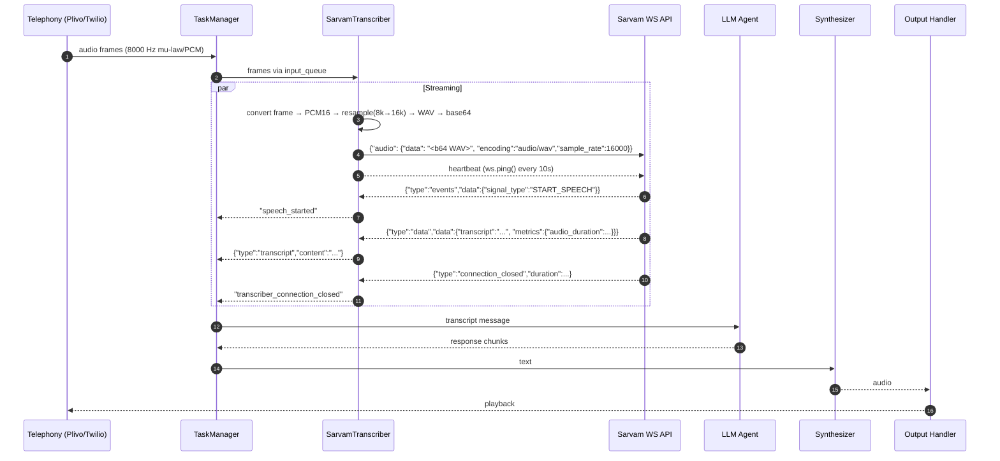

## Sarvam Transcriber (Streaming + HTTP) for Bolna

### Overview
This document explains how the Sarvam transcriber in Bolna works end-to-end, covering:
- Real-time streaming transcription via WebSocket (primary)
- Batch transcription via HTTP (fallback/offline)
- Audio processing (mu-law conversion, resampling, WAV packaging)
- Connection/auth, message schemas, VAD events, heartbeats
- Integration with `TaskManager` and message flow
- Configuration, environment variables, logging, and troubleshooting

This implementation mirrors the structure of `DeepgramTranscriber` but adapts to Sarvam’s API specifics (WAV+base64 payloads, subprotocol auth, and message schemas).

---

### Key Files
- `bolna/transcriber/sarvam_transcriber.py`
- `bolna/transcriber/base_transcriber.py`
- `bolna/transcriber/deepgram_transcriber.py` (reference)

---

### Quick Start

- Environment
  - Set `SARVAM_API_KEY` (or pass `transcriber_key` in kwargs)
- Typical config (via `TaskManager`):
  - `provider`: `plivo` or `twilio` (telephony), or others
  - `model`: `saarika:v2.5`
  - `language`: `en-IN`
  - `stream`: `true`
  - Optional: `high_vad_sensitivity`, `vad_signals`

Example (conceptual):
```python
import asyncio
from bolna.transcriber.sarvam_transcriber import SarvamTranscriber

async def main():
    input_q = asyncio.Queue()
    output_q = asyncio.Queue()

    transcriber = SarvamTranscriber(
        telephony_provider="plivo",
        input_queue=input_q,
        output_queue=output_q,
        model="saarika:v2.5",
        language="en-IN",
        stream=True,
        high_vad_sensitivity=True,
        vad_signals=True,
    )

    # Start transcriber
    await transcriber.run()

    # Push audio frames as bytes into input_q with meta_info
    await input_q.put({"data": b"...8k PCM or mu-law...", "meta_info": {"sequence": 0, "eos": False}})
    # ...
    # Signal end-of-stream
    await input_q.put({"data": b"", "meta_info": {"sequence": 0, "eos": True}})

    # Consume output
    while True:
        msg = await output_q.get()
        print("Transcriber out:", msg)
        if msg["data"] == "transcriber_connection_closed":
            break

asyncio.run(main())
```

---

### Architecture



---

### Modes

#### 1) Streaming (WebSocket)
- URL: `wss://api.sarvam.ai/speech-to-text/ws?model=<MODEL>&language-code=<LANG>[&high_vad_sensitivity=true][&vad_signals=true][&target_language=..]`
- Auth: WebSocket subprotocol: `api-subscription-key.<SARVAM_API_KEY>`
- Audio send format:
```json
{
  "audio": {
    "data": "<base64 WAV bytes>",
    "encoding": "audio/wav",
    "sample_rate": 16000
  }
}
```
- Incoming messages:
  - Transcript
    ```json
    {"type":"data","data":{"transcript":"...","language_code":"...","metrics":{"audio_duration": ...}}}
    ```
    Mapped to:
    ```json
    {"data":{"type":"transcript","content":"..."}, "meta_info":{...}}
    ```
  - VAD events
    ```json
    {"type":"events","data":{"signal_type":"START_SPEECH"}}
    ```
    Mapped to: `"speech_started"`
  - Connection closed
    ```json
    {"type":"connection_closed","duration": ...}
    ```
    Mapped to: `"transcriber_connection_closed"`

- Heartbeat
  - `ws.ping()` every 10 seconds to keep the connection alive.

- Provider audio handling
  - `plivo` (and `twilio`) send 8 kHz frames. Sarvam expects 16 kHz WAV:
    - If `mulaw`: convert mu-law → linear PCM16
    - Resample to 16 kHz
    - Wrap in WAV
    - Base64-encode
  - Frame cadence defaults to ~200 ms (`audio_frame_duration = 0.2`)

- End-of-stream (EOS)
  - When a packet has `meta_info.eos=True`, the transcriber stops sending and closes the WS.

#### 2) HTTP (Batch)
- URL: `https://api.sarvam.ai/speech-to-text`
- Headers: `api-subscription-key: <SARVAM_API_KEY>`
- Multipart form fields:
  - `file`: audio/wav (single combined buffer of received frames)
  - `model`: model name (e.g., `saarika:v2.5`)
  - `language_code`: e.g., `en-IN`
- Response handled as:
  - transcript: `response["transcript"]`
  - duration: `response["duration"]`
  - Mapped to a transcript packet; deduped across flushes.

- Buffering & flush
  - Frames accumulated and flushed periodically (default ~2.5s) or on EOS.

---

### Integration with TaskManager

- Input
  - `TaskManager` writes audio packets to `SarvamTranscriber.input_queue`
  - Packet shape: `{"data": <bytes>, "meta_info": {..., "sequence": int, "eos": bool}}`
- Output
  - `SarvamTranscriber` yields messages to `TaskManager.transcriber_output_queue` via `push_to_transcriber_queue`
  - Notable outputs:
    - `"speech_started"`
    - `{"type":"transcript","content":"..."}` (structured transcript payload)
    - `"transcriber_connection_closed"`

- Lifecycle
  - `run()` → creates `transcribe()` task
  - Streaming path runs `sender_stream`, `receiver`, and `send_heartbeat` concurrently
  - `toggle_connection()` cancels sender/heartbeat and sets `connection_on=False`
  - Always emits a final `"transcriber_connection_closed"` on clean exit

---

### Configuration

Constructor (key params):
- `telephony_provider`: `"plivo"`, `"twilio"`, or others
- `model`: default `saarika:v2.5`
- `language`: default `en-IN`
- `stream`: bool (True for WS)
- `encoding`: `"linear16"` or `"mulaw"` (auto-adjusted for known providers)
- `sampling_rate`: default `16000` (converted internally for WS payload)
- `high_vad_sensitivity`: bool (adds `high_vad_sensitivity=true` to WS URL)
- `vad_signals`: bool (adds `vad_signals=true` to WS URL)
- `target_language`: optional (adds `target_language` to WS URL)
- `transcriber_key` (kwargs) overrides `SARVAM_API_KEY` env var

Provider-specific audio parameters:
- `plivo`:
  - `encoding="linear16"`
  - `input_sampling_rate=8000`, `sampling_rate=16000`
  - `audio_frame_duration=0.2` (seconds)
- `twilio`:
  - `encoding="mulaw"`
  - `input_sampling_rate=8000`, `sampling_rate=16000`
  - `audio_frame_duration=0.2`

---

### Latency & Metrics

- Streaming
  - Connection time: measured at connect (`connection_time` in ms)
  - For transcripts: uses `metrics.audio_duration` (if provided) as `transcriber_duration`
- HTTP
  - `transcriber_latency`: round-trip time for the HTTP POST
  - `transcriber_duration`: parsed from API response (if present)
- Final signal
  - Always pushes `"transcriber_connection_closed"` (with `transcriber_duration` when available)

Tip: To compute averages, collect `latency_dict` in your run output or enable DEBUG logging to log raw timings per turn.

---

### Logging

- Uses `bolna.helpers.logger_config.configure_logger`
- INFO logs cover connection lifecycle and key events; DEBUG logs cover audio conversion and frame sizes
- To reduce verbosity, demote these to DEBUG if desired:
  - Received WS message dumps
  - Queue push notifications

---

### Error Handling

- WS connect failures log an error and raise
- Heartbeat failures are warned and break the loop
- HTTP:
  - Rate limit (429) raised upstream (caller should backoff)
  - Non-200 logs response text and returns empty transcript packet
- Audio conversion:
  - mu-law → PCM16 conversion via `audioop.ulaw2lin`
  - Resample via `audioop.ratecv` (warns but continues if resample fails)
  - Any conversion error returns `None` (frame skipped for WS; HTTP call aborted)

---

### Differences vs Deepgram

- Same lifecycle (connect → concurrent sender/receiver/heartbeat) and integration points
- Sarvam-specifics:
  - WebSocket auth via subprotocol: `api-subscription-key.<KEY>`
  - Requires WAV-encoded, base64 audio payload per frame
  - URL uses `language-code` (kebab-case)
  - VAD events mapped from `"events"` messages; only `START_SPEECH` is surfaced by default
  - Heartbeat: `ws.ping()` (Deepgram uses JSON KeepAlive)
- HTTP mode kept intact, but normalized transcripts to structured payloads for consistency

---

### Troubleshooting

- No transcripts arriving
  - Verify `ws_url` query params (model, `language-code`, optional VAD flags)
  - Ensure audio is converted to WAV 16 kHz and base64-encoded
  - Check that heartbeat is running
  - Confirm subprotocol auth (no header-based auth)
- Twilio contacts yield garbled audio
  - Ensure mulaw → PCM16 conversion precedes resampling
- High latency or timeouts
  - Inspect network and WS ping; increase heartbeat frequency only if necessary
  - Reduce INFO logs to avoid overhead during heavy load

---

### Security

- API key is passed via WS subprotocol (not an HTTP header)
- Avoid logging the key; logs only include key length in DEBUG builds (if you add such logs), otherwise omitted

---

### Minimal Example Output Packets

- Speech started
```json
{"data":"speech_started","meta_info":{...}}
```

- Transcript
```json
{"data":{"type":"transcript","content":"..."}, "meta_info":{...}}
```

- Connection closed
```json
{"data":"transcriber_connection_closed","meta_info":{"transcriber_duration": ...}}
```

---

### Maintenance Notes

- Plivo/Twilio providers default to 8 kHz input; always upsample to 16 kHz for Sarvam WS (WAV)
- You can tune `high_vad_sensitivity` and `vad_signals` via constructor
